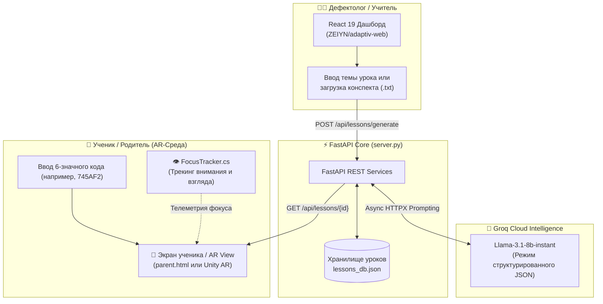

# 🧠 ZEIYN | Адаптив-AR (Adaptiv Web Server)

<div align="center">

### *Инклюзивная образовательная фиджитал-платформа: адаптация школьной программы в 3D/AR-пространство с помощью ИИ для детей с особыми потребностями (РАС, СДВГ, ЗПР).*

[](https://www.python.org/)
[](https://fastapi.tiangolo.com/)
[](https://react.dev/)
[](https://vitejs.dev/)
[](https://www.framer.com/motion/)
[](https://groq.com/)
[](https://unity.com/)
[](https://tailwindcss.com/)

[**О проекте**](#-о-проекте) • [**Инклюзивные профили**](#-инклюзивная-адаптация-нозологии) • [**Архитектура**](#-архитектура-системы) • [**Возможности**](#-ключевой-функционал) • [**Стек**](#-стек-технологий) • [**Быстрый старт**](#-быстрый-старт) • [**API эндпоинты**](#-rest-api-справочник)

---

</div>

## 📖 О проекте

**ZEIYN («Зейін» — с каз. *Внимание, Фокус, Разум*) / Адаптив-AR** — это фиджитал-экосистема для коррекционной педагогики и инклюзивного образования.

Платформа решает проблему сложности восприятия абстрактного учебного материала детьми с нейроотличиями. Используя генеративный искусственный интеллект (LLM), система в реальном времени трансформирует сложный конспект урока или произвольную тему в **интерактивную пошаговую 3D/AR-среду**, генерируя:
1. Визуальные образы и интерактивные 3D-элементы (счетные сферы, манипуляторы, визуальные якоря).
2. Четкие методические указания и пошаговые инструкции для тьютора или дефектолога.
3. Тексты озвучки, поддержки и похвалы, откалиброванные под конкретный психоэмоциональный профиль ребенка.

---

## 🎯 Инклюзивная адаптация (Нозологии)

ИИ автоматически перестраивает структуру подачи материала в зависимости от выбранного профиля ребенка:

| Профиль | Особенности восприятия | Принцип адаптации ИИ |
| :--- | :--- | :--- |
| **РАС (Аутизм)** | Высокая чувствительность к сенсорной перегрузке, потребность в четкой структуре | Прямые понятные формулировки, отсутствие метафор, предсказуемые шаги, минималистичная визуализация без отвлекающих шумов. |
| **СДВГ** | Дефицит внимания, быстрая потеря фокуса, потребность в динамике | Короткие микро-шаги (спринты), динамичные визуальные стимулы, геймифицированные интерактивные действия, яркая похвала за каждый шаг. |
| **ЗПР** | Замедленный темп усвоения, потребность в наглядности | Максимально простое пошаговое расщепление понятий, опора на конкретные осязаемые 3D-образы (яблоки, сферы), повторение закрепления. |
| **Норма** | Стандартная школьная программа | Углубленная визуализация сложных концептов в 3D для ускоренного усвоения материала. |

---

## 🏗 Архитектура системы



---

## ✨ Ключевой функционал

- 🪄 **Генерация 3D/AR-урока по теме:** Введите любую тему (например, *«Основы сложения до 5»* или *«Строение молекулы воды»*), и ИИ мгновенно подготовит сценарий фиджитал-урока.
- 📄 **Генерация из файла конспекта (.txt):** Загрузите черновой файл конспекта учителя — нейросеть вычленит ключевую дидактическую цель и сформирует 4 адаптивных шага.
- 🔑 **Короткие коды уроков (PIN/ID):** Каждому уроку присваивается легкий 6-значный буквенно-цифровой идентификатор (например, `D20414`). Ученику или родителю достаточно ввести его на своем устройстве.
- 📱 **Режим ученика (Адаптив-AR View):** Автономный экран с имитацией дополненной реальности, интерактивными карточками шагов и прямыми подсказками для тьютора.
- 💻 **Дизайнерский React-дашборд:**
  - Поддержка темной и светлой темы с мягким неоновым свечением (Ambient Orbs).
  - 3D-анимация логотипа на Framer Motion.
  - Роли в системе: **«Дефектолог»** и **«Родитель»**.
  - Разделы: *«Уроки»*, *«Мои ученики»*, *«Аналитика стресса и фокуса»*, *«Настройки»*.
- 🎯 **Unity C# FocusTracker:** Интеграционный модуль для трекинга внимания, фиксации взгляда ребенка на учебных объектах и предотвращения переутомления.

---

## 🗂 Структура репозитория

```bash
Adaptiv_Web_Server/
├── ZEIYN/
│   ├── server.py             # Основной FastAPI бэкенд (генерация, валидация, API)
│   ├── lessons_db.json       # База сгенерированных уроков и их структуры
│   ├── adaptiv_ar.db         # Локальная база данных SQLite
│   ├── index.html            # Автономный веб-интерфейс учителя (Tailwind CSS)
│   ├── parent.html           # Автономный AR-экран ученика / родителя
│   ├── FocusTracker.cs       # C# скрипт трекинга фокуса для Unity
│   │
│   └── adaptiv-web/          # Полноценное SPA-приложение (Vite + React 19)
│       ├── src/
│       │   ├── App.jsx       # Главный компонент (авторизация, дашборд, анимации)
│       │   ├── App.css
│       │   ├── index.css
│       │   ├── main.jsx
│       │   └── assets/       # Логотипы и графические ассеты
│       ├── package.json      # Зависимости React 19, Framer Motion, Vite
│       └── vite.config.js    # Конфигурация сборщика Vite
│
└── .gitignore                # Исключения (node_modules, __pycache__, .env)
```

---

## 🛠 Стек технологий

| Компонент | Технологии | Назначение |
| :--- | :--- | :--- |
| **Backend API** | Python 3.10+, FastAPI, httpx, Pydantic | Асинхронный сервер обработки запросов и генерации |
| **Artificial Intelligence** | Groq Cloud, Llama 3.1 8B Instant | Мгновенный инференс сценариев уроков в формате JSON |
| **Frontend SPA** | React 19, Vite 8, Framer Motion 12 | Интерактивный портал дефектолога с плавной 3D-анимацией |
| **Standalone UI** | HTML5, Tailwind CSS, Vanilla JS | Легковесные мобильные экраны ученика и учителя без сборки |
| **AR & Hardware** | Unity C# (`FocusTracker.cs`) | Отслеживание внимания и концентрации взгляда |
| **Data Storage** | JSON DB (`lessons_db.json`), SQLite | Хранение профилей, сессий и сгенерированных программ |

---

## 🚀 Быстрый старт

### 1. Клонирование репозитория
```bash
git clone https://github.com/Ali-bit-bot-ux/Adaptiv_Web_Server.git
cd Adaptiv_Web_Server
```

---

### 2. Запуск бэкенда (FastAPI)

1. Перейдите в директорию `ZEIYN`:
   ```bash
   cd ZEIYN
   ```

2. Создайте и активируйте виртуальное окружение:
   ```bash
   python -m venv .venv
   # Windows:
   .venv\Scripts\activate
   # Linux / macOS:
   source .venv/bin/activate
   ```

3. Установите зависимости:
   ```bash
   pip install fastapi uvicorn httpx pydantic python-dotenv python-multipart
   ```

4. Создайте файл `.env` в папке `ZEIYN`:
   ```ini
   GROQ_API_KEY=gsk_ваш_ключ_groq_api
   ```
   *(Бесплатный API ключ можно получить на [console.groq.com](https://console.groq.com))*

5. Запустите сервер:
   ```bash
   uvicorn server:app --reload --host 127.0.0.1 --port 8000
   ```
   *Сервер будет доступен по адресу: `http://127.0.0.1:8000` (Swagger документация: `/docs`).*

---

### 3. Запуск веб-дашборда (React + Vite)

В отдельном окне терминала:

1. Перейдите в папку веб-приложения:
   ```bash
   cd ZEIYN/adaptiv-web
   ```

2. Установите зависимости npm:
   ```bash
   npm install
   ```

3. Запустите локальный сервер разработки:
   ```bash
   npm run dev
   ```
   *Дашборд откроется по адресу: `http://localhost:5173`.*

---

### 4. Запуск автономных экранов (Без Node.js)

Если вам нужно быстро открыть экран ученика без развертывания Vite:
- Откройте файл `ZEIYN/parent.html` прямо в браузере (или через расширение VS Code *Live Server*).
- Введите сгенерированный ID урока и нажмите **«Запустить 3D-среду»**.

---

## 📡 REST API Справочник

### 1. Генерация урока по теме
- **Эндпоинт:** `POST /api/lessons/generate`
- **Тело запроса:**
  ```json
  {
    "topic": "Основы сложения до 5",
    "diagnosis": "СДВГ"
  }
  ```
- **Успешный ответ (200 OK):**
  ```json
  {
    "id": "745AF2",
    "topic": "Основы сложения до 5",
    "diagnosis": "СДВГ",
    "steps": [
      {
        "step_number": 1,
        "spheres_count": 0,
        "title": "Введение",
        "voiceover_text": "Привет! Сегодня мы поиграем с волшебными сферами.",
        "ar_visual_element": "Появление 2 ярких парящих сфер",
        "teacher_action": "Привлеките внимание ребенка к светящимся объектам",
        "is_interactive": false
      }
    ]
  }
  ```

### 2. Генерация урока из файла конспекта
- **Эндпоинт:** `POST /api/lessons/generate_from_file`
- **Формат:** `multipart/form-data` (`file`: текстовый документ `.txt`, `diagnosis`: строка нозологии).

### 3. Получение структуры урока
- **Эндпоинт:** `GET /api/lessons/{lesson_id}`
- **Параметры:** `lesson_id` — 6-значный буквенно-цифровой идентификатор (регистронезависимый).

---

## 🗺 Планы развития (Roadmap)

- [ ] ⌚ **Интеграция с Samsung Galaxy Watch (Tizen / Wear OS):** Мониторинг пульса и кожно-гальванической реакции ребенка для предиктивного определения сенсорной перегрузки.
- [ ] 🥽 **Полноценный WebXR / Unity 3D клиент:** Наложение 3D-моделей прямо через камеру мобильного телефона или AR-очки.
- [ ] 🎙️ **Синтез речи (TTS):** Автоматическое чтение закадрового текста и похвалы приятным адаптивным детским голосом.
- [ ] 📈 **ML-модель прогресса:** Построение индивидуальной карты обучаемости и удержания внимания ребенка.

---

## 👥 Авторство и контакты

Разработано командой проекта **ZEIYN**:
- **Ali-bit-bot-ux** — Архитектура бэкенда, промпт-инжиниринг ИИ, фронтенд и инклюзивный UX.

⭐ **Поддержите проект звездочкой на GitHub**, если разделяете идеи доступного и инклюзивного образования!
